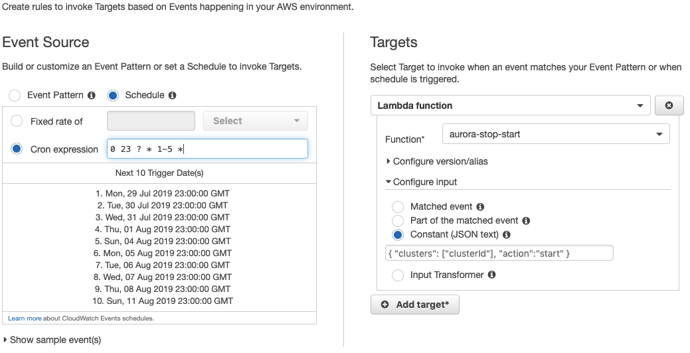

# AWS Aurora Start/Stop

Amazon Aurora now allows users to start and stop database clusters:
https://aws.amazon.com/about-aws/whats-new/2018/09/amazon-aurora-stop-and-start/

However, the database instance cannot be stopped/started. Only the database
cluster can. This Lambda function can be used to start and stop an Aurora cluster on a schedule.

### Instructions

1. Create an IAM Role with full Lambda/RDS access.
2. Create a NodeJS Lambda function. Compress the code (index.js, start.js, stop.js, package.json) as a ZIP and upload it.
3. Select the IAM Role created for the Lambda function.

## Testing

Test Stop Event:

```
{ "clusters": ["clusterId"], "action":"stop" }
```

Test Start Event:

```
{ "clusters": ["clusterId"], "action":"start" }
```

Replace `clusterId` with the DB Cluster ID found in Configuration.

### Scheduling

For scheduling the Lambda function:

- Create a CloudWatch Rule.
- For event source, create your schedule. Example: Schedule | Cron | 0 9 ? * 2-6 * => That will run every day from Monday to Friday at 9:00 AM.
- Click Add Target and select your Lambda Function.
- Click Configure Test Input and select Constant (JSON Text).
- Select the corresponding JSON snippet for your rule. e.g. Start cluster at 9am, stop cluster at 6pm.


